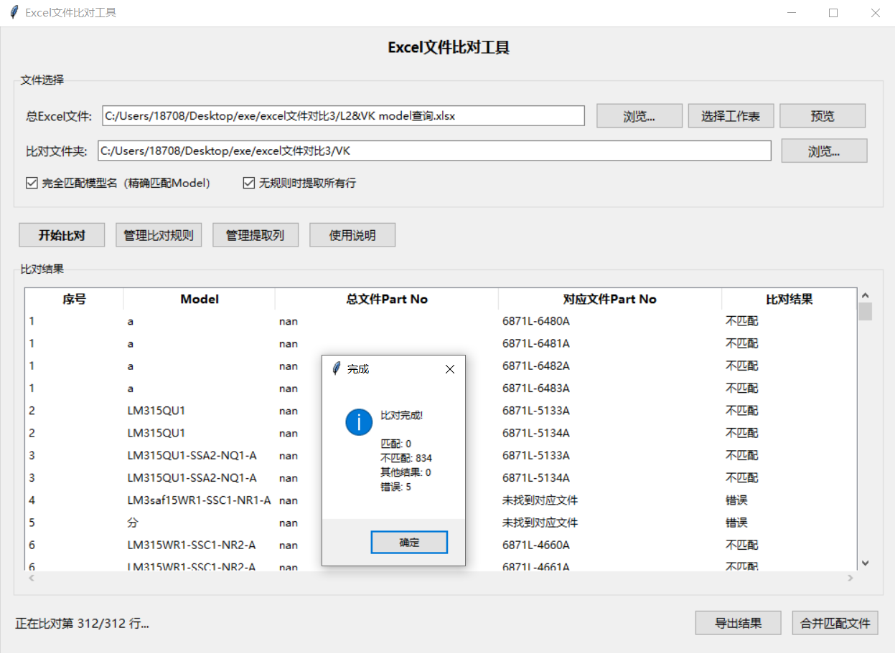
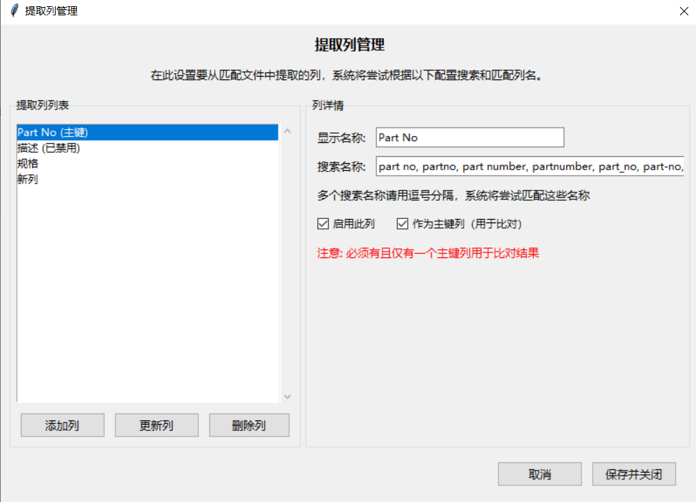
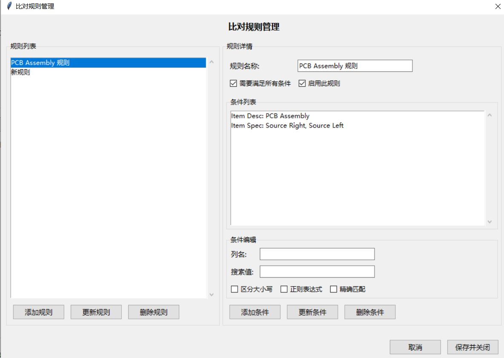

# Excel文件比对工具


Excel文件比对工具 - 一款功能全面的数据比对与提取应用程序，专为解决企业级Excel文件管理难题而设计。本工具支持智能模型匹配、自定义规则引擎、灵活列配置和批量数据处理功能，能够高效处理大量Excel和CSV文件的比对、验证和整合任务。
核心功能包括：自适应文件格式识别、多条件规则匹配、正则表达式支持、智能列名识别、批量文件处理、匹配结果分类展示、数据导出与合并等。适用于物料清单管理、BOM核验、产品配置对比、数据合规检查和跨系统数据迁移等场景。
基于Python开发，具有直观的图形界面，无需编程知识即可配置和使用。支持Excel(.xlsx/.xls)和CSV文件，兼容多种编码格式，能够应对企业环境中的复杂数据比对需求。

## 📋 目录

- [核心功能](#核心功能)
- [应用场景](#应用场景)
- [系统要求](#系统要求)
- [安装步骤](#安装步骤)
- [使用指南](#使用指南)
- [功能详解](#功能详解)
- [常见问题](#常见问题)
- [更新日志](#更新日志)
- [贡献指南](#贡献指南)
- [许可证](#许可证)

## 🔍 核心功能

### 文件处理能力
- ✅ 支持Excel(.xlsx/.xls)和CSV文件格式
- ✅ 自动识别和适配多种文件编码(UTF-8, GBK, GB18030等)
- ✅ 智能工作表识别和选择
- ✅ 批量文件处理和结果合并

### 比对引擎
- ✅ 完整和部分模型名匹配模式
- ✅ 自定义比对规则引擎，支持多条件逻辑组合
- ✅ 条件支持精确匹配、部分匹配和正则表达式
- ✅ 大小写敏感选项和多值匹配支持

### 数据提取
- ✅ 自定义提取列配置，支持多名称识别
- ✅ 主键列标识和自动匹配
- ✅ 智能列名匹配(支持模糊匹配和别名识别)
- ✅ 按规则提取数据或全量提取选项

### 结果处理
- ✅ 分类结果显示(匹配、不匹配、其他结果、错误)
- ✅ 匹配文件自动保存和管理
- ✅ 结果数据导出为Excel
- ✅ 匹配文件合并(单表或多工作表模式)

### 用户体验
- ✅ 直观的图形用户界面
- ✅ 实时状态更新和进度显示
- ✅ 文件预览功能
- ✅ 详细操作指南和帮助文档

<div align="center">
  <div style="display: inline-block; max-width: 85%; margin: 25px 0; border-radius: 12px; overflow: hidden; box-shadow: 0 6px 18px rgba(0,0,0,0.1); border: 1px solid #eaeaea;">
    <div style="background: linear-gradient(135deg, #6a11cb 0%, #2575fc 100%); padding: 15px; color: white; font-weight: bold; font-size: 1.2em; text-align: left;">
      Excel比对工具主界面
    </div>
    <div style="padding: 2px; background-color: white;">
      
    </div>
    <div style="background-color: #f9f9f9; padding: 12px; text-align: left; border-top: 1px solid #eaeaea;">
      <span style="color: #444; font-size: 0.9em;">主界面提供文件选择、比对选项设置和结果展示功能</span>
    </div>
  </div>
</div>

<div align="center">
  <div style="display: inline-block; max-width: 85%; margin: 25px 0; border-radius: 12px; overflow: hidden; box-shadow: 0 6px 18px rgba(0,0,0,0.1); border: 1px solid #eaeaea;">
    <div style="background: linear-gradient(135deg, #11998e 0%, #38ef7d 100%); padding: 15px; color: white; font-weight: bold; font-size: 1.2em; text-align: left;">
      提取列管理界面
    </div>
    <div style="padding: 2px; background-color: white;">
      
    </div>
    <div style="background-color: #f9f9f9; padding: 12px; text-align: left; border-top: 1px solid #eaeaea;">
      <span style="color: #444; font-size: 0.9em;">灵活配置提取列，支持多名称识别与主键设置</span>
    </div>
  </div>
</div>

<div align="center">
  <div style="display: inline-block; max-width: 85%; margin: 25px 0; border-radius: 12px; overflow: hidden; box-shadow: 0 6px 18px rgba(0,0,0,0.1); border: 1px solid #eaeaea;">
    <div style="background: linear-gradient(135deg, #ff9966 0%, #ff5e62 100%); padding: 15px; color: white; font-weight: bold; font-size: 1.2em; text-align: left;">
      比对规则管理界面
    </div>
    <div style="padding: 2px; background-color: white;">
      
    </div>
    <div style="background-color: #f9f9f9; padding: 12px; text-align: left; border-top: 1px solid #eaeaea;">
      <span style="color: #444; font-size: 0.9em;">自定义比对规则，支持多条件组合和复杂匹配逻辑</span>
    </div>
  </div>
</div>

## 🚀 应用场景

### 制造业与供应链
- **物料清单(BOM)比对**：验证不同版本BOM中的物料差异
- **供应商数据核验**：比对供应商提供的清单与内部标准
- **生产配置管理**：提取特定类型的生产配置数据

### 品质与合规
- **质检数据分析**：从多个质检报告中提取并整合特定指标
- **合规性检查**：识别不符合规定标准的数据项
- **变更管理**：追踪和比较产品规格的变更情况

### 数据管理与集成
- **系统迁移验证**：比对迁移前后的数据一致性
- **数据清洗与转换**：批量识别和提取符合特定格式的数据
- **跨部门数据整合**：从多个部门文件中提取关键数据并合并

### 财务与审计
- **预算比对**：比较计划预算与实际支出
- **价格分析**：从多个价格清单中提取并比对特定品类
- **费用核验**：识别异常或超标的费用项目

## 💻 系统要求

- **操作系统**：Windows 7/8/10/11
- **Python版本**：Python 3.6或更高版本
- **依赖库**：
  - pandas
  - numpy
  - openpyxl
  - tkinter (Python标准库，通常随Python安装)

## 📥 安装步骤

1. **安装Python环境**
   - 从[Python官网](https://www.python.org/downloads/)下载并安装Python 3.6+
   - 安装时勾选"Add Python to PATH"选项

2. **安装所需依赖**
   ```bash
   pip install pandas openpyxl
   ```

3. **下载程序**
   - 克隆本仓库或下载ZIP文件
   ```bash
   git clone https://github.com/Xie-Rutai/Excel-Comparison-Tool.git
   cd Excel-Comparison-Tool
   ```

4. **运行程序**
   ```bash
   python test.py
   ```

## 📖 使用指南

### 基本操作流程

1. **设置文件路径**
   - 点击"浏览..."选择主Excel文件
   - 如需要，点击"选择工作表"指定特定工作表
   - 点击"浏览..."选择比对文件夹(包含需要比对的文件)

2. **配置比对选项**
   - 选择"完全匹配模型名"或取消勾选使用部分匹配
   - 根据需要勾选"无规则时提取所有行"

3. **管理比对规则**
   - 点击"管理比对规则"按钮
   - 添加规则并设置规则名称
   - 添加条件，指定列名和搜索值
   - 设置是否需要满足所有条件、是否启用规则

4. **管理提取列**
   - 点击"管理提取列"按钮
   - 设置需要提取的列名及其搜索名称
   - 指定主键列(用于比对判断)

5. **执行比对**
   - 点击"开始比对"按钮
   - 等待比对完成
   - 查看结果表格中的比对情况

6. **处理结果**
   - 点击"导出结果"将比对结果导出为Excel文件
   - 点击"合并匹配文件"将所有匹配文件合并为一个文件

### 比对结果解释

- **匹配**：找到的Part No与主文件完全相同
- **不匹配**：找到的Part No与主文件不同
- **其他结果**：在有匹配结果的情况下，同时找到的其他不匹配Part No
- **错误**：未找到对应文件或处理中出错

## 🔧 功能详解

### 比对规则引擎

比对规则用于定义如何从比对文件中找到相关数据。每条规则包含一个或多个条件，条件指定了列名和搜索值。

**规则配置示例：**

1. **PCB Assembly规则**
   - 条件1：列名="Item Desc", 搜索值="PCB Assembly"
   - 条件2：列名="Item Spec", 搜索值="Source Right,Source Left"
   - 要求：满足所有条件

2. **电子元件规则**
   - 条件1：列名="类别", 搜索值="电子元件,电子器件"
   - 条件2：列名="产地", 搜索值="进口"
   - 要求：满足所有条件

### 提取列配置

提取列用于定义从比对文件中提取哪些数据。每个列配置包含显示名称和搜索名称列表。

**列配置示例：**

1. **Part No列**
   - 显示名称："Part No"
   - 搜索名称："part no,partno,part number,partnumber,零件号,料号"
   - 设置为主键列

2. **描述列**
   - 显示名称："描述"
   - 搜索名称："description,desc,描述,item desc"

### 高级选项

- **完全匹配模型名**：启用时使用正则表达式确保模型名称的完整匹配
- **无规则时提取所有行**：启用时，当没有适用规则时提取所有行，否则返回"未找到符合条件的Part No"

## ❓ 常见问题

### 问题：程序无法识别我的文件中的列
**解决方案**：在"管理提取列"中为该列添加更多可能的搜索名称。系统支持模糊匹配，但添加准确的列名可提高匹配成功率。

### 问题：比对结果显示"未找到对应文件"
**解决方案**：
1. 检查Model名称在文件名中是否存在
2. 尝试关闭"完全匹配模型名"选项，允许部分匹配
3. 确保比对文件夹包含正确的文件

### 问题：找不到符合条件的Part No
**解决方案**：
1. 检查比对规则是否正确设置
2. 查看文件中的实际列名和值是否与规则匹配
3. 启用"无规则时提取所有行"选项
4. 使用文件预览功能检查文件内容

### 问题：CSV文件编码问题
**解决方案**：程序会自动尝试多种编码（UTF-8、GBK、GB18030等），但如果仍有问题，可以先用Excel打开CSV文件并另存为XLSX格式。

## 📝 更新日志

### 版本 1.0.0 (2025-4-02)
- 初始版本发布
- 实现核心比对功能
- 支持自定义规则和提取列
- 提供基本的结果处理功能

## 👥 贡献指南

欢迎贡献代码、报告问题或提出改进建议！

1. Fork本仓库
2. 创建特性分支 (`git checkout -b feature/AmazingFeature`)
3. 提交更改 (`git commit -m 'Add some AmazingFeature'`)
4. 推送到分支 (`git push origin feature/AmazingFeature`)
5. 创建Pull Request

## 📄 许可证

本项目采用MIT许可证 - 详见[LICENSE](LICENSE)文件
